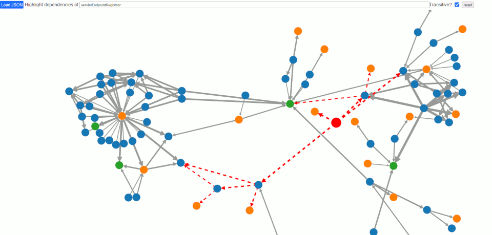

# Spring Beans Dependency Visualizer

The Spring Boot Actuator contains the [`/beans`](https://docs.spring.io/spring-boot/docs/current/actuator-api/htmlsingle/#beans) endpoint which provides information about the beans loaded when an application runs.

This tool helps in visualizing the dependencies between beans. It works entirely client-side, so no data leaves
the browser.

It is available [here](https://smurf667.github.io/beans-visualizer).

To build it, run

	npm install
	npm run webpack

Launch `dist/index.html` in a browser. Select a JSON file captured from the Spring Boot Actuator `/beans`
endpoint and start analyzing. Enjoy!
